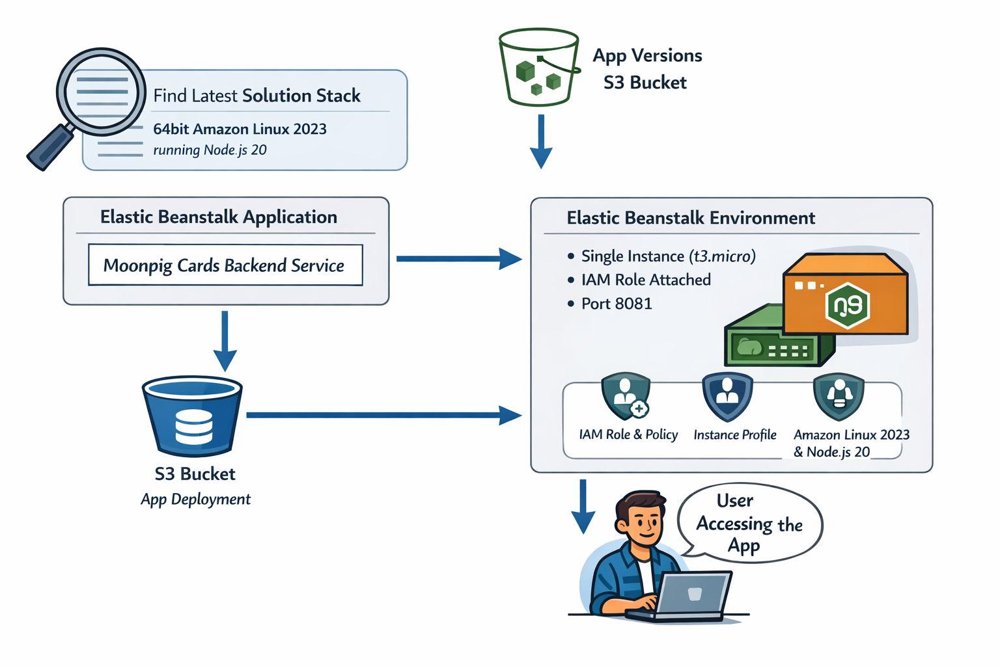

# Project Notes & Improvement Suggestions

## How to Use

- **Live Demo:**  
  You can check a live demo of the API here:  
  [http://moonpig-service-dev.eba-bx7ukerd.eu-west-1.elasticbeanstalk.com](http://moonpig-service-dev.eba-bx7ukerd.eu-west-1.elasticbeanstalk.com)

- **Local Setup & Deployment:**
  1. **Clone the repository:**
     ```sh
     git clone https://github.com/Szfinx5/cards-backend
     cd cards-backend
     ```
  2. **Provision infrastructure (AWS Elastic Beanstalk, S3, IAM) with Terraform:**
     ```sh
     cd infra
     terraform init
     terraform apply
     ```
  3. **Push your change to development and merge it to the `main` branch.**  
     This will trigger the CI/CD pipeline, which will build and deploy the latest code to AWS Elastic Beanstalk.

---

## Timebox

All work, including implementation, testing, and documentation, was almost completed within a 4-hour window.

**Time breakdown:**

- **1 hour:** Research, requirements analysis, and project planning (including reviewing the API spec, data sources, and deciding on architecture and tooling).
- **1 hour:** Setting up the project framework (dummy routes), infrastructure as code (Terraform), and initial CI/CD configuration.
- **1 hour:** Implementing core business logic (API endpoints, data transformation, error handling).
- **1.5 hours:** Writing comprehensive unit and integration tests to achieve 100% coverage, including edge cases and mocking external dependencies.
- **0.5 hour:** Documentation, code cleanup, and final review.

---

## Architecture Diagram

<p align="center">
  
</p>

---

## Design Decisions & Trade-offs

- **Express.js Monolith:**  
  Chose a simple Express.js server for rapid development and clarity. This is suitable for small-scale or prototype APIs, but may not scale as well as serverless or microservice approaches.

- **In-Memory Data Fetching:**  
  Data is fetched from static JSON endpoints on each request. This is simple but not optimal for performance or scalability. Ideally, API endpoint would support pagination and filtering.

- **Error Handling:**  
  API returns clear error messages and appropriate HTTP status codes for common failure cases (e.g., 404 for not found, 500 for server errors).

- **TypeScript:**  
  Used for type safety and maintainability. All core logic is typed, but some type assertions (`as any`) are used in tests.

- **Testing:**  
  Achieved 100% test coverage with Jest and Supertest. Mocked external data sources and their return values.

- **Service Layer Pattern**
  Decoupled data transformation from Express controllers. This enabled 100% unit test coverage and ensures the logic is independent of the transport layer (HTTP).

- **Infrastructure as Code (IaC)**
  Used Terraform to create AWS Elastic Beanstalk, IAM Roles, and S3. This ensures a simply and reproducible deployments.

---

## Suggestions for Further Improvements if time permitted

- **Serverless Refactor:**  
  Refactoring the API as AWS Lambda functions behind API Gateway. This would improve scalability, reduce operational overhead, and fit well with event-driven architectures.

- **Caching:**  
  Implementing in-memory caching (e.g., with Redis) for fetched data to reduce latency and external requests. For distributed deployments, prefer Redis or DynamoDB DAX.

- **Environment Variables & Config:**  
  Moving all configuration (API URLs, ports, etc.) to environment variables for flexibility and security.

- **Validation:**  
  Adding input validation (e.g., using `Joi` or `zod`) for all endpoints to ensure robust API contracts and better error messages.

- **API Documentation:**  
  Adding Swagger documentation for easier integration and maintenance.

- **CI/CD Pipeline:**  
  Integrate linting (`eslint`), formatting (`prettier`), and security/static analysis (`tflint`, `tfsec` for infra, `npm audit` for code) into a CI pipeline.

- **Edge Case Handling:**  
  See the edge case section below for open questions and scenarios that may need further clarification or business logic.

- **Pagination & Filtering:**  
  For `/cards`, we should add pagination and filtering for scalability.

- **Rate Limiting & Security:**  
  Add rate limiting and security headers (e.g., with `helmet`) for production readiness.

---

## Edge Cases to Consider

- What should happen if a card has an empty `sizes` array (i.e., the card is not available in any size)?
  - Does it mean that the card is not available in any size?
- If the requested `sizeId` is not present in the card's available sizes, should we:
  - Return the default 'md' size and price?
  - Return an error indicating the requested size is not available?
- What if the card has no `pages` or the `pages` array is empty?
- What if a page references a template that does not exist in the templates array?
- How should we handle a card with a `basePrice` of 0 or a negative value?
- Should we support case-insensitive matching for `cardId` and `sizeId`?
- How should we handle unexpected or additional properties in the input data?

---

## General Comments

- The codebase is modular and easy to extend.
- All business logic is covered by unit and integration tests.
- The project is ready for further extension and production hardening with the above improvements.
